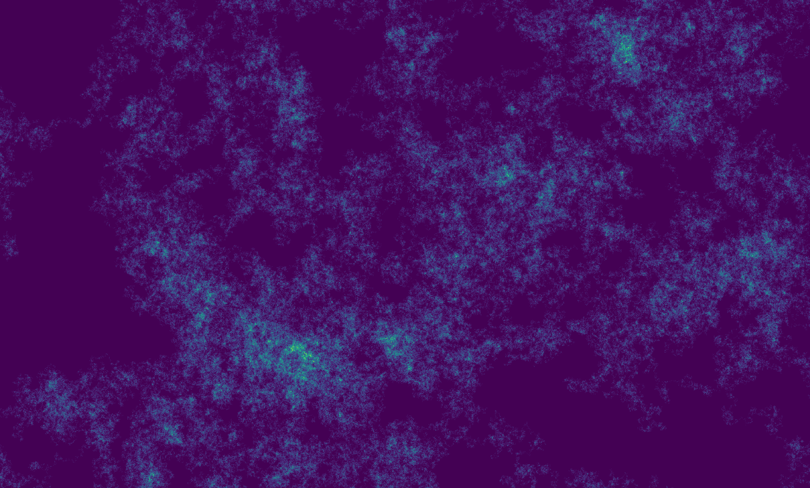

# r.random.walk

GRASS GIS module that calculates a random walk over a given area.

The module provides control of the number of steps and directions (4 or 8) the walker can take, and allows the walkers behavior to be set to revisit or avoid cells. The output displays the frequency the walker visited each cell if the walker is allowed to revisit cells. If the walker behavior is set to avoid previously visited cells the starting cell and ending cell will be marked.

```bash
r.random.walk -r input=raster output=walk_result steps=10000 directions=8-dir
```


